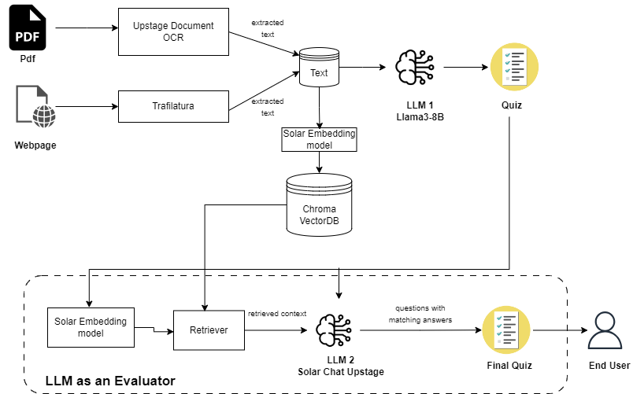

# Automatic Quiz Generator (Upstage Hackathon)
## Overview
Upload any pdf or website, and get high quality LLM evaluated MCQ questions with answers in a matter of seconds

## How does it work?

- **Quiz generation Pipeline**: extracts the text from webpage or pdf and passes it to Llama 3 to generate a quiz in JSON format.
- **Quiz evaluation Pipeline**: evaluates the quiz generated by the quiz generation pipeline. Uses RAG with Solar Embeddings and Chroma retriever to get relevant context for the given question. UpstageChat uses this context to answer the question. If answers of Llama 3 and UpstageChat match, question is retained, if answers do not match, question is discarded

## Demo

## How is Upstage API used?
1. **Upstage Document OCR** : To extract text from uploaded pdf
2. **Upstage Solar Embedding API** : To convert the text to embedding to be used in RAG portion of LLM as an evaluator
3. **Upstage Chat API** : Used to generate answer from question (and thus used as evaluator LLM)

## How to run it locally?

## To dos
- [ ] Clean code and structure code properly
- [ ] Integrate LLM as an evaluator code into Gradio app
- [ ] Check groundedness of the RAG in LLM as an evaluator using Groundedness API
- [ ] Get LLM explanation on why it choose an answer
- [ ] Support other languages like Korean

